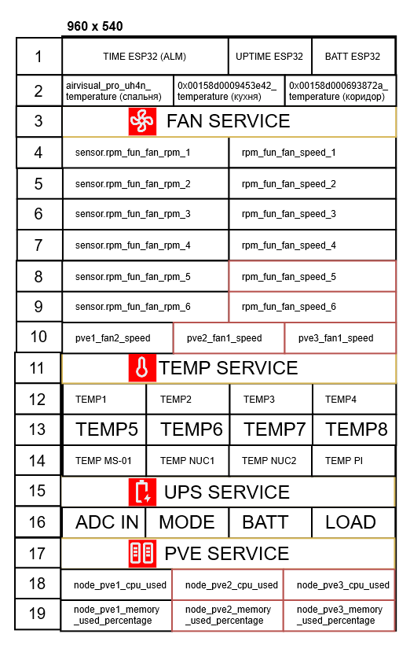

# m5paper_esphome

**ESPHome Project for M5Paper**  
This project is designed to control the M5Paper display using ESPHome. It integrates functionality from several original projects and includes sensor integration, timers, and services for home automation.

---

## Features

- **ESPHome Integration:** Leverage the power of ESPHome to control your device.
- **M5Paper Display:** Operate an IT8951E-based display with customizable layouts.
- **Sensor Integration:** Built-in sensors for temperature, humidity, battery, UPS, and other diagnostic data.
- **BM8563 RTC Support:** Time synchronization via BM8563 (based on [TomG7363/esphome-BM8563](https://github.com/TomG7363/esphome-BM8563)).
- **Optional Touchscreen:** Possibility to control via a touchscreen (based on GT911).
- **Custom Settings:** Update intervals, layout, and fonts are configurable via YAML.
- **Screen Example:** The repository includes an example screen layout for visualizing data.

> **Note:** This project is a work in progress. All components are functional, but bugs and imperfections may still exist.

---

## Installation and Setup

1. **Clone the repository:**

   ```bash
   git clone https://github.com/yourusername/m5paper_esphome.git
   cd m5paper_esphome
   ```

2. **Dependencies:**
   - Install [ESPHome](https://esphome.io/) (recommended version not lower than `2024.12.4`).
   - Ensure you have access to Git, the Arduino framework, and PSRAM (the board used is `m5stack-grey`).

3. **Fonts:**
   - Download the Material Design Icons font from [materialdesignicons.com](https://materialdesignicons.com/).
   - Place the `materialdesignicons-webfont.ttf` file into the `fonts` folder.

4. **Wi-Fi and OTA Configuration:**
   - Edit the `secrets.yaml` file to specify your Wi-Fi, OTA, and API key settings.

5. **Upload the configuration:**
   - Once configured, run ESPHome to upload the firmware to your device:
   
     ```bash
     esphome run m5paper_esphome.yaml
     ```

---

## Project Structure

- **m5paper_esphome.yaml:** The main ESPHome configuration file that includes all components from the display to sensors.
- **packages/**
  - **display.yaml:** Display configuration, layout rows, and graphical elements.
  - **main.yaml:** Core network, OTA, API, and logging settings.
- **fonts/** – Folder for custom fonts (don’t forget to add Material Design Icons).

---

## Connected Components

- **BM8563 RTC:** Time synchronization via Home Assistant and BM8563.
- **Temperature and Humidity Sensors:** Utilizing the SHT3XD and additional sensors.
- **Diagnostic Sensors:** Monitoring battery level, Wi-Fi status, CPU and memory usage, and system uptime.
- **Buttons and Switches:** Functionality for ESP reboot and display update.

---

## Customization and Expansion

This project is based on the following repositories:

- [timit3-github/m5paper_esphome](https://github.com/timit3-github/m5paper_esphome)
- [paveldn/m5paper_esphome](https://github.com/paveldn/m5paper_esphome)
- [sebirdman/m5paper_esphome](https://github.com/sebirdman/m5paper_esphome)

Thanks to these works, display integration and sensor functionalities have been successfully implemented.

---

## Contributing

If you encounter bugs or have suggestions for improvements:
- **Open an issue** – we welcome your feedback.
- **Submit a pull request** – community contributions help make the project better.

---

## License

This project is licensed under the [MIT License](LICENSE).

---

## Screen Example

<table>
  <tr>
    <td align="center">
      
      <br>
      <strong>Prototype</strong>
    </td>
    <td align="center">
      
      <br>
      <strong>Real Screen Photo</strong>
    </td>
  </tr>
</table>
*Example screen layout displaying sensor data and diagnostic information.*

---

## Conclusion

m5paper_esphome is a flexible and customizable solution for integrating the M5Paper display into your home automation system. The project is actively evolving, and we welcome your contributions!

For additional questions and support, please refer to the [issues](https://github.com/yourusername/m5paper_esphome/issues).

---

*Happy tinkering and successful experiments!*
